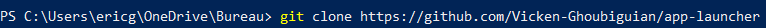
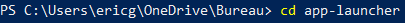
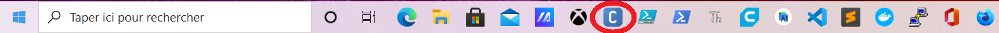
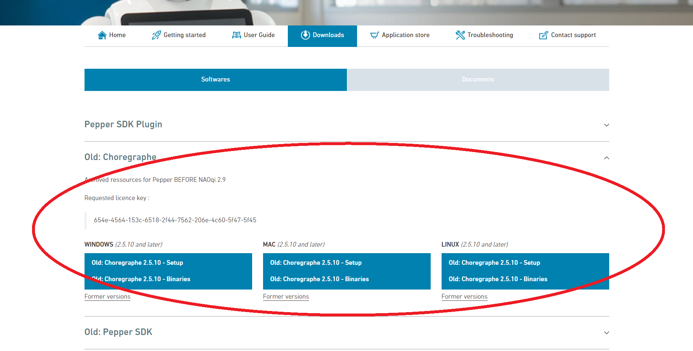
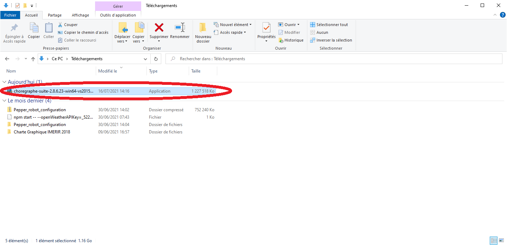
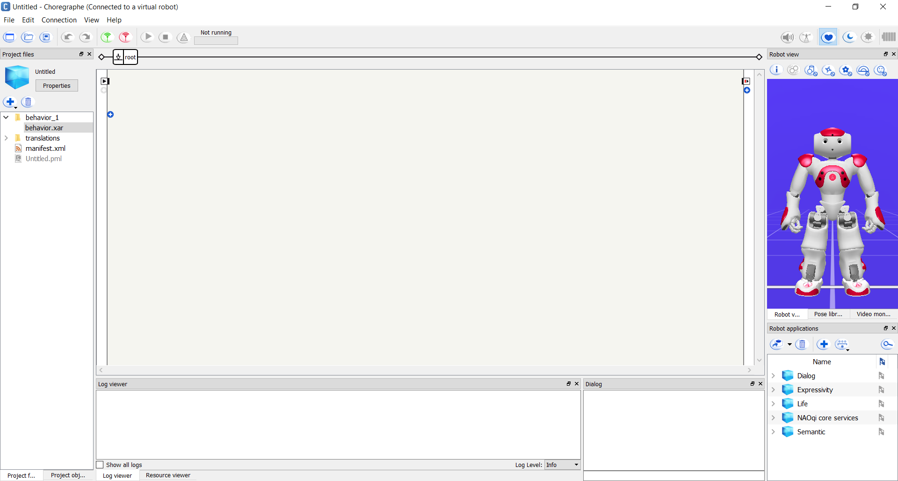
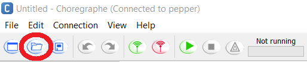
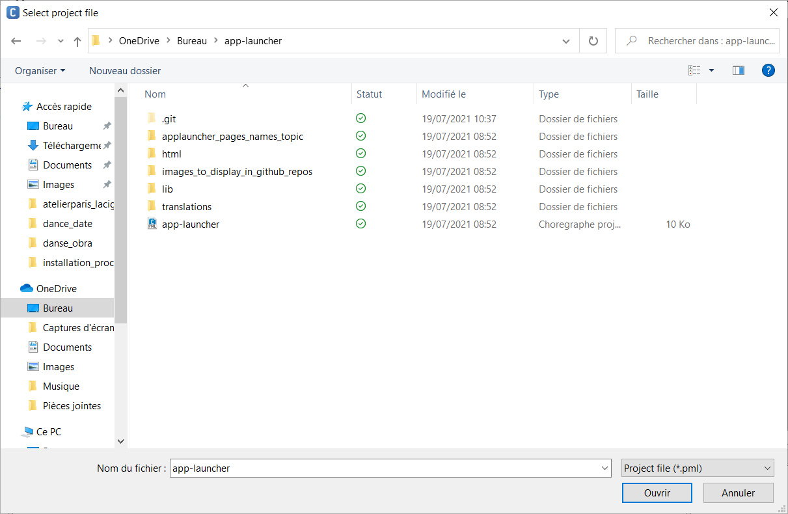
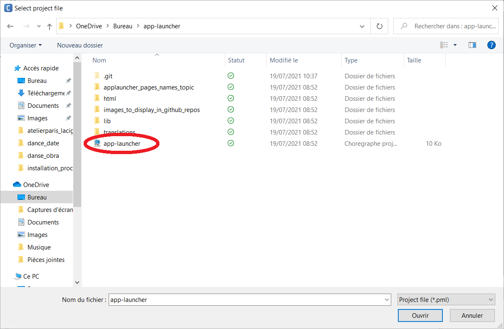
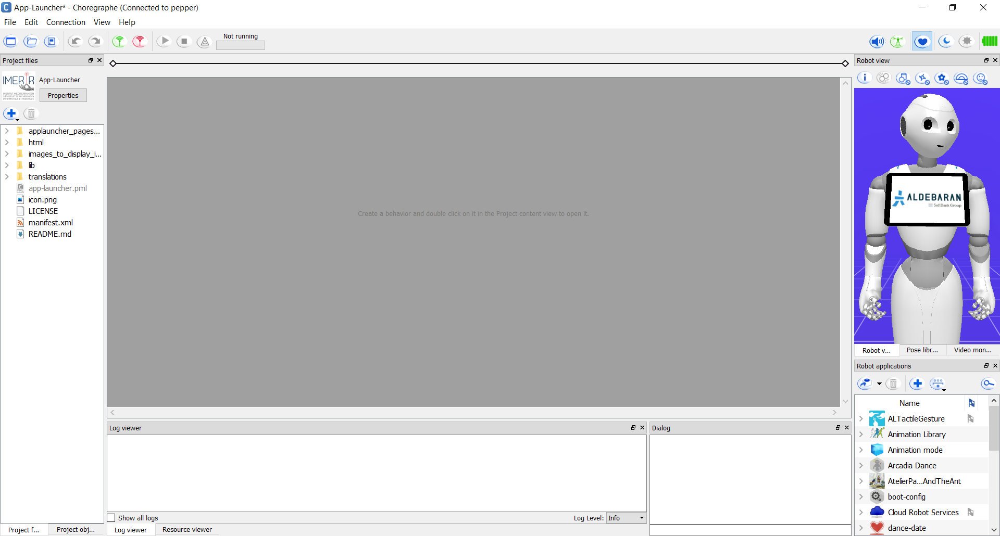

# app-launcher
This is a project to develop a customized app launcher for the IMERIR Pepper robot...

## Contents

1. [Introduction](#introduction)
2. [Presentation of this project](#presentation_of_this_project)
3. [How was this project developed ?](#how_was_developed)
4. [What are this project's components ?](#what_are_components)
5. [Where find this project ?](#where_find_it)
6. [How to install this app-launcher on the Pepper robot ?](#how_to_install_this_app_launcher_on_pepper_robot)
7. [Useful links](#useful_links)
8. [Conclusion](#conclusion)

## Introduction

IMERIR is an engineering school providing training in IT, connected objects, artificial intelligence, maker culture and robotics. By the way, here is its logo:

This school has a humanoid robot known as Pepper. Initially manufactured and marketed by the French company Aldebaran robotics, the production and marketing of Pepper was taken over by the Japanese company Softbank when the latter acquired Aldebaran robotics. Here is an image of this robot so emblematic of humanoid robotics:

## Presentation of this project

This project consists to develop a customized app launcher for the IMERIR Pepper robot.

## How was this project developed ?

## What are this project's components ?

## Where find this project ?

## How to install this app-launcher on the Pepper robot ?

In this section, we will install this project (the customized IMERIR app-launcher) on the Pepper robot of IMERIR.
After this procedure completed, Pepper's app-launcher will be like illustrated by screenshots below.

The screenshot above is the main view of the app-launcher.

The screenshot above shows the main app-launcher window with an open menu containing some parameters for the robot (top right) to decrease the sound, increase the sound and activate/deactivate mute on Pepper.

The screenshot above corresponds to the view to choose the application to launch.

Therefore please follow the instructions below carefully in order:

1. To start, you need to clone the Git repository of the “app-launcher” project hosted on GitHub, using the “git clone https://github.com/Vicken-Ghoubiguian/app-launcher ” command as shown below.

2. Now please position yourself in the newly created "app-launcher" directory using the "cd app-launcher" command as shown in the screenshot below:

3. Please open the Choregraphe software, the Pepper robot development and administration software developed by Softbank robotics. On Microsoft's Windows platform, you can either click on the software icon in the taskbar (for example) as shown below:

If you haven't installed the Choregraphe software, you can do so by downloading the installer from the official Softbank robotics website (at this link:https://www.softbankrobotics.com/emea/en/support/pepper-naoqi-2-9/downloads-softwares) as shown in the screenshot below:

__Warning__: the version of the Choregraphe software that you download and therefore that you wish to install must correspond to the version of the NAOqi operating system installed on your robot. For example if your robot works under version 2.5.10 of the NAOqi operating system, then you must download and install version 2.5.10 of the Choregraphe software.

The Choregraphe software installer is then downloaded to your computer. Now you need to run it to install the software. This is illustrated by the screenshot below:

Now that the Choregraphe software is open on your computer, the following window opens as shown below:

Now is the time to move on the next step (more precisely the fourth).

4. Now it's time to open the Choregraphe "app-launcher" project that you cloned from GitHub, essential prerequisite to install this "app-launcher" on the Pepper robot. To do this, please click on "file"> "open project..." in the Choregraphe software, as shown in the next screenshot.

__Warning__: you could also click on the button , like indicated on the next screenshot.

The following window shown in the screenshot below is displayed and invites you to open the Choregraphe application you want (here the IMERIR app-launcher). To do it, you must open the corresponding Choregraphe project file:

When you have gone to the location of the "app-launcher" project directory and positioned yourself in it, click on the corresponding Choregraphe project file as shown in the screenshot below:

Congratulations, now the app "app-launcher" is open as shown in the screenshot below:

Now is the time to move on the next step (the fifth).

5. Now is the time to install the app-launcher from the computer where you clone it on your Pepper robot.

6. Congratulations, the IMERIR's app launcher is now installed as shown on the following screenshots.

## Useful links

* the project that served as a basis: https://github.com/softbankrobotics-labs/app-launcher,
* the manual for a quick and efficient use of the Pepper robot (in french): https://docs.google.com/document/d/1ZAIgvsyCzpJZ3wD4W-0Gt4teEFrPybbgo8e2c1v9GA4/edit#heading=h.mdynxomnaje9,
* 
* 

## Conclusion
