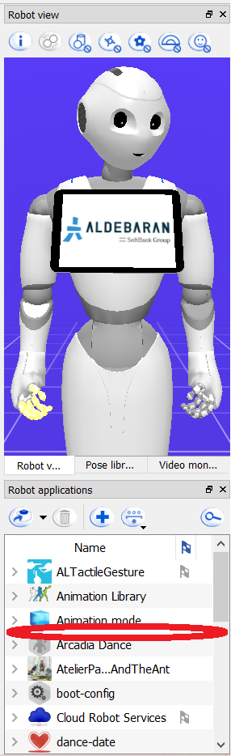
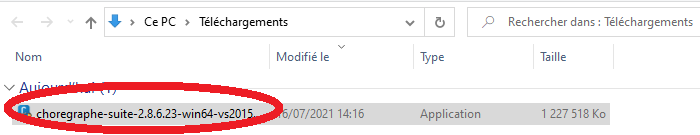
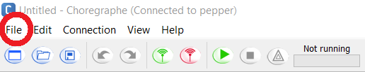

# app-launcher
This is a customized app launcher for the IMERIR Pepper robot (for NAOqi 2.5) forked from the [Softbank robotics labs one](https://github.com/softbankrobotics-labs/app-launcher)...

## Contents

1. [Introduction](#introduction)
2. [Presentation of this project](#presentation_of_this_project)
3. [How was this project developed ?](#how_was_developed)
4. [What is the app-launcher Git folder's structure](#what_is_structure)
5. [What are this project's components ?](#what_are_components)
6. [Where find this project ?](#where_find_it)
7. [How to install this app-launcher on the Pepper robot ?](#how_to_install_this_app_launcher_on_pepper_robot)
8. [Useful links](#useful_links)
9. [Conclusion](#conclusion)

## Introduction

IMERIR is an engineering school providing training in IT, connected objects, artificial intelligence, maker culture and robotics. By the way, here is its logo:

This school has a humanoid robot known as Pepper. Initially manufactured and marketed by the French company Aldebaran robotics, the production and marketing of Pepper was taken over by the Japanese company Softbank when the latter acquired Aldebaran robotics. Here is an image of this robot so emblematic of humanoid robotics:

IMERIR uses the Pepper robot as the school mascot during various trade shows, meetings and professional forums focused on computer technologies and robotics as well as geek culture. 
As shown in some photos below, the Pepper robot from IMERIR is emulated wherever it goes.

## Presentation of this project

This project consists to develop a customized app launcher for the IMERIR Pepper robot. It is a program which runs as soon as the robot is fully started, which allows you to select which application to run and which serves as a showcase for the operating organization to display its identity, brand and visuals.

__With custom IMERIR app-launcher__

__With default Pepper's app-launcher (https://github.com/softbankrobotics-labs/app-launcher)__

__Without app-launcher__

## How was this project developed ?

This project is a fork of this [one](https://github.com/softbankrobotics-labs/app-launcher), so the latest was therefore taken over to serve as the basis for the customized IMERIR app-launcher. The images used in the forked app-launcher have been replaced according to the school's graphic charter. It was also the same for the family font and used colors. Some stuff has also been changed and the code has been cleaned up and the trick has finally been played.

## What is the app-launcher Git folder's structure

The app-launcher Git folder contains these elements:

* __app-launcher__:

* __images_to_display_in_github_repos__:

* __COPYING.md__: 

* __LICENSE__: file to define the software license of the current Git project (from the forked project LICENSE: https://github.com/softbankrobotics-labs/app-launcher/blob/master/COPYING.md),

* __README.md__: markdown file to present and document the current Git project with tutorials and some details. 

## What are this project's components ?

## Where find this project ?

This project can only be find here, in the current GitHub repos. The original project is available just [here](https://github.com/softbankrobotics-labs/app-launcher).

## How to install this app-launcher on the Pepper robot ?

In this section, we will install this project (the customized IMERIR app-launcher) on the Pepper robot of IMERIR.
After this procedure completed, Pepper's app-launcher will be like illustrated by screenshots below.

The screenshot above is the main view of the app-launcher.

The screenshot above shows the main app-launcher window with an open menu containing some parameters for the robot (top right) to decrease the sound, increase the sound and activate/deactivate mute on Pepper.

The screenshot above corresponds to the view to choose the application to launch.

__Warning__: in order to install the IMERIR app-launcher, you must ensure that no other app-launcher is installed on the Pepper robot. There are 2 clues to help you get started.

__First clue__: the digital tablet of the Pepper robot displays the interface shown in the screenshot below, that appears when no app-launcher is installed.

__Second clue__: there is no app-launcher (application with the name "app-launcher") installed on the Pepper robot, Therefore there is no app-launcher at all.

If an app-launcher is installed on your Pepper robot, you must remove it. How ? Very simple. As shown in the screenshot below, you must select the app-launcher application in the "Robot applications" menu then click on the button :

Therefore please follow the instructions below carefully in order:

1. To start, you need to clone the Git repository of the “app-launcher” project hosted on GitHub, using the “git clone https://github.com/Vicken-Ghoubiguian/app-launcher ” command as shown below.

2. Now please position yourself in the newly created "app-launcher" directory using the "cd app-launcher" command as shown in the screenshot below:

3. Please open the Choregraphe software, the Pepper robot development and administration software developed by Softbank robotics. On Microsoft's Windows platform, you can either click on the software icon in the taskbar (for example) as shown below:

If you haven't installed the Choregraphe software, you can do so by downloading the installer from the official Softbank robotics website (at this link:https://www.softbankrobotics.com/emea/en/support/pepper-naoqi-2-9/downloads-softwares) as shown in the screenshot below:

__Warning__: the version of the Choregraphe software that you download and therefore that you wish to install must correspond to the version of the NAOqi operating system installed on your robot. For example if your robot works under version 2.5.10 of the NAOqi operating system, then you must download and install version 2.5.10 of the Choregraphe software.

The Choregraphe software installer is then downloaded to your computer. Now you need to run it to install the software. This is illustrated by the screenshot below:

Now that the Choregraphe software is open on your computer, the following window opens as shown below:

Now is the time to move on the next step (more precisely the fourth).

4. Now it's time to open the Choregraphe "app-launcher" project that you cloned from GitHub, essential prerequisite to install this "app-launcher" on the Pepper robot. To do this, please click on "file"> "open project..." in the Choregraphe software, as shown in the next screenshot.

__Warning__: you could also click on the button , like indicated on the next screenshot.

The following window shown in the screenshot below is displayed and invites you to open the Choregraphe application you want (here the IMERIR app-launcher). To do it, you must open the corresponding Choregraphe project file:

When you have gone to the location of the "app-launcher" project directory and positioned yourself in it, click on the corresponding Choregraphe project file as shown in the screenshot below:

Congratulations, now the app "app-launcher" is open as shown in the screenshot below:

Now is the time to move on the next step (the fifth).

5. Now is the time to install the app-launcher from the computer where you clone it on your Pepper robot. To do this, please click on the button . This button has 2 options:

    * __Package and install current project to the robot__: packages and installs the open application in the Choregraphe software on the Pepper robot,

    * __Install a package to the robot...__: installs a packaged application on the Pepper robot.

The first option is the default option for this button. So each time you click on it, the Choregraphe software packages the open application and then installs it on the Pepper robot.

Its position in the Choregraphe software interface is illustrated by the screenshot below.

Once you have pressed the button  therefore, the following window appears and indicates the percentage of the transfer of the application to be installed (here our app-launcher) from your machine to the robot in percentage (%).

Once at 100%, the following window appears showing that the application is installed on the Pepper robot.

Once this window disappears, the installation of the application is complete.

6. Congratulations, the IMERIR's app launcher is now installed as shown on the following screenshots.

## Useful links

* the post on Stack Overflow answering the 'How to create apps launcher at Pepper's tablet' question: https://stackoverflow.com/questions/59045692/how-to-create-apps-launcher-at-peppers-tablet,
* the original project, the forked one: https://github.com/softbankrobotics-labs/app-launcher,
* the manual for a quick and efficient use of the Pepper robot (in french): https://docs.google.com/document/d/1ZAIgvsyCzpJZ3wD4W-0Gt4teEFrPybbgo8e2c1v9GA4/edit#heading=h.mdynxomnaje9

## Conclusion

Despite the simplicity of this project, writing its documentation was complicated.
