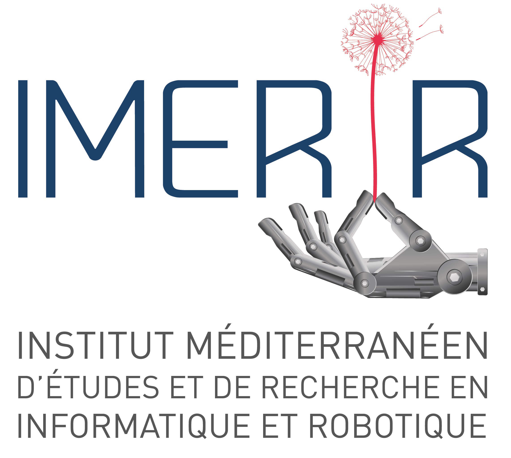

# app-launcher
This is a project to develop a customized app launcher for the IMERIR Pepper robot...

## Contents

1. [Introduction](#introduction)
2. [Presentation of this project](#presentation_of_this_project)
3. [What are this project's components ?](#what_are_components)
4. [Where find this project ?](#where_find_it)
5. [How to install it on the Pepper robot ?](#how_to_install_it_on_pepper_robot)
6. [Useful links](#useful_links)
7. [Conclusion](#conclusion)

## Introduction

IMERIR is an engineering school providing training in IT, connected objects, artificial intelligence, maker culture and robotics.

This school has a humanoid robot known as Pepper. Initially manufactured and marketed by the French company Aldebaran robotics, the production and marketing of Pepper was taken over by the Japanese company Softbank when the latter acquired Aldebaran robotics.

## Presentation of this project

## What are this project's components ?

## Where find this project ?

## How to install it on the Pepper robot ?

## Useful links

## Conclusion
